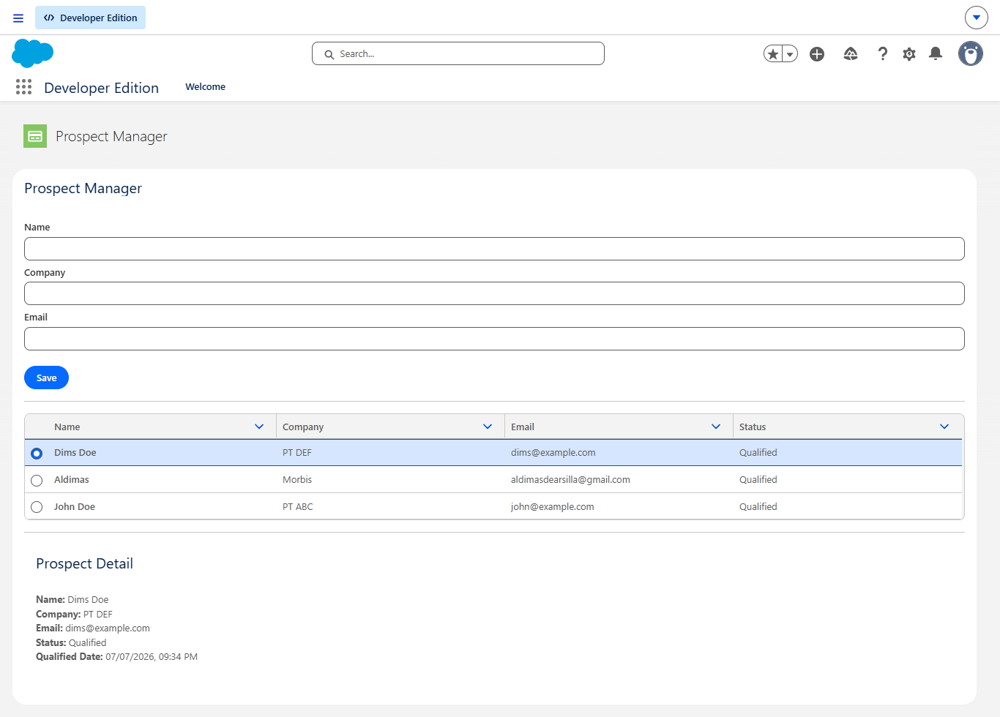

# Prospect Manager - Salesforce Technical Assessment

## Overview

Prospect Manager is a simple Salesforce application built using **Lightning Web Components (LWC)** and **Apex** to help the Sales team manage prospective customers.

The application allows users to:

- Add new prospects
- View a list of prospects
- View prospect details
- Mark a prospect as **Qualified**
- Automatically record the date and time when a prospect becomes **Qualified**

---

## Features

- ✅ Create Prospect
- ✅ View Prospect List
- ✅ View Prospect Detail
- ✅ Mark Prospect as Qualified
- ✅ Automatically save Qualified Date & Time
- ✅ Toast notification after successful actions
- ✅ Automatically refresh list and detail after update

---

## Tech Stack

- Salesforce Developer Edition
- Apex
- Lightning Web Components (LWC)
- Salesforce Lightning Experience
- Salesforce CLI
- VS Code + Salesforce Extension Pack

---

## How to Run

### 1. Clone the repository

```bash
git clone <repository-url>
cd <project-folder>
```

### 2. Login to your Salesforce Developer Org

```bash
sf org login web
```

Follow the browser authentication process.

---

### 3. Deploy metadata

```bash
sf project deploy start
```

---

### 4. Open Salesforce

```bash
sf org open
```

---

### 5. Open the application

Open the **Prospect Manager** Lightning App Page that has been created in Lightning App Builder.

---

## Project Structure

```
force-app/
└── main/
    └── default/
        ├── classes/
        │   └── ProspectController.cls
        │
        ├── lwc/
        │   └── prospectManager/
        │       ├── prospectManager.html
        │       ├── prospectManager.js
        │       └── prospectManager.js-meta.xml
        │
        ├── objects/
        │   └── Prospect__c/
```

### Folder Description

| Folder | Description |
|---------|-------------|
| classes | Apex controller containing business logic |
| lwc | Lightning Web Component for UI |
| objects | Custom Object and Custom Fields |

---

## Assumptions

The following assumptions were used during development:

- The application runs on a Salesforce Developer Edition org.
- Prospect data is stored in a custom object named `Prospect__c`.
- Prospect status consists of:
  - New
  - Contacted
  - Qualified
- New prospects are created with the default status **New**.
- When **Mark as Qualified** is clicked:
  - Status is updated to **Qualified**
  - `Qualified_Date__c` is automatically filled using `System.now()`
- The Qualified button is only shown when the selected prospect has not yet been qualified.
- Email validation uses the standard `lightning-input` component with `type="email"`.

---

## Things Not Yet Implemented

All features requested in the assessment have been successfully implemented.



# Pendekatan Implementasi

## Bagaimana fitur ini diimplementasikan di Salesforce

Fitur ini diimplementasikan dengan menggabungkan fitur deklaratif Salesforce dan pengembangan menggunakan kode. Data calon pelanggan disimpan pada Custom Object `Prospect__c`, sedangkan antarmuka pengguna dibuat menggunakan Lightning Web Components (LWC). Proses seperti menambahkan data, menampilkan daftar, melihat detail, dan mengubah status menjadi **Qualified** ditangani melalui Apex.

---

## Bagian yang dapat dibuat menggunakan konfigurasi (Declarative)

Beberapa bagian dapat dibuat tanpa menulis kode, di antaranya:

- Membuat **Custom Object** `Prospect__c`.
- Membuat field seperti **Company**, **Email**, **Status**, dan **Qualified Date**.
- Membuat nilai **Picklist** untuk Status (`New`, `Contacted`, `Qualified`).
- Membuat **Lightning App Page** menggunakan Lightning App Builder.
- Mengatur **Page Layout**, Field Level Security, dan hak akses pengguna.

---

## Bagian yang memerlukan kode

Beberapa kebutuhan lebih sesuai dibuat menggunakan kode, yaitu:

- Membuat tampilan form dan daftar calon pelanggan.
- Menambahkan data calon pelanggan melalui form.
- Menampilkan detail calon pelanggan.
- Menjalankan proses **Mark as Qualified**.
- Mengubah status menjadi **Qualified** sekaligus menyimpan tanggal dan waktu saat status tersebut berubah.
- Memperbarui data pada halaman secara otomatis setelah terjadi perubahan.

---

## Teknologi Salesforce yang digunakan

| Teknologi | Alasan |
|-----------|--------|
| **Lightning Web Components (LWC)** | Digunakan untuk membangun antarmuka pengguna yang interaktif dan responsif. |
| **Apex** | Digunakan untuk menangani logika bisnis dan proses CRUD ke Salesforce. |
| **Custom Object** | Digunakan untuk menyimpan data calon pelanggan. |
| **Lightning App Builder** | Digunakan untuk menampilkan komponen LWC pada halaman Salesforce. |
| **SLDS (Salesforce Lightning Design System)** | Digunakan agar tampilan aplikasi mengikuti standar desain Salesforce. |